# Mermaid Diagram Skill

Generate well-structured, colorful diagrams using Mermaid syntax. Produces both editable source files and rendered PNGs.

## When to Use

Activate when the user mentions any of:
- "diagram", "flowchart", "chart", "schema", "visualization"
- "architecture", "system design", "overview"
- "ER diagram", "database schema", "entity relationship"
- "sequence diagram", "API flow", "request flow"
- "state machine", "state diagram", "lifecycle"
- "class diagram", "UML", "inheritance"
- "gantt", "timeline", "project plan", "roadmap"
- "pie chart", "breakdown", "distribution"
- "mindmap", "brainstorm map", "concept map"
- "git flow", "branching strategy", "git graph"
- "C4 diagram", "system context", "container diagram"
- "kanban", "board", "workflow board"
- "org chart", "hierarchy"

## Prerequisites

Mermaid CLI renders diagrams to PNG/SVG:
```bash
npx --yes @mermaid-js/mermaid-cli -i input.mmd -o output.png -b white --scale 2
```
Auto-installs via npx on first use. No setup required.

## Workflow

1. Determine the best diagram type for the user's request (see Decision Guide below)
2. Create `<name>.mmd` file with Mermaid syntax
3. Render: `npx --yes @mermaid-js/mermaid-cli -i <name>.mmd -o <name>.png -b white --scale 2`
4. Show the PNG to the user via Read tool
5. If user wants a markdown doc, also create `.md` with embedded ```mermaid blocks

**Always produce both:** `<name>.mmd` (editable source) + `<name>.png` (rendered image)

## Diagram Type Decision Guide

| User Wants | Diagram Type | Syntax Keyword |
|------------|-------------|----------------|
| Process flow, decision tree, algorithm | **Flowchart** | `flowchart TD` or `flowchart LR` |
| API calls, request/response, message passing | **Sequence** | `sequenceDiagram` |
| Database tables and relationships | **ER Diagram** | `erDiagram` |
| Object-oriented design, interfaces | **Class Diagram** | `classDiagram` |
| Lifecycle, state transitions | **State Diagram** | `stateDiagram-v2` |
| Data distribution, percentages | **Pie Chart** | `pie title ...` |
| Project schedule, milestones | **Gantt Chart** | `gantt` |
| Idea exploration, topic breakdown | **Mindmap** | `mindmap` |
| Historical events, chronological | **Timeline** | `timeline` |
| Git branching, merge strategy | **Git Graph** | `gitgraph` |
| System architecture (C4 model) | **C4 Diagram** | `C4Context` / `C4Container` / `C4Component` / `C4Dynamic` / `C4Deployment` |
| Task board, workflow stages | **Kanban** | `kanban` |
| Component layout, block arrangement | **Block Diagram** | `block` |
| Two-axis comparison, priority matrix | **Quadrant Chart** | `quadrantChart` |
| Data flow volumes, proportional | **Sankey** | `sankey` |
| Data plots, bar/line charts | **XY Chart** | `xychart` |
| User experience steps, satisfaction | **User Journey** | `journey` |
| Compliance, traceability | **Requirement** | `requirementDiagram` |
| Network topology, cloud infra | **Architecture** | `architecture-beta` |
| Org chart, hierarchy | **Flowchart TD** | `flowchart TD` with subgraphs |
| Radar/spider comparison | **Radar** | `radar-beta` |

---

## Diagram Types & Syntax Reference

### 1. Flowchart (most common)

**Direction:** `TD` (top-down), `LR` (left-right), `BT` (bottom-top), `RL` (right-left)

**Node shapes:**
```
A["Rectangle"]          B("Rounded")         C(["Stadium"])
D[["Subroutine"]]       E[("Cylinder/DB")]   F(("Circle"))
G>"Asymmetric"]         H{"Diamond"}         I{{"Hexagon"}}
J[/"Parallelogram"/]    K[\"Parallelogram"\]
```

**Link types:**
```
A --> B                  %% Arrow
A --- B                  %% Line (no arrow)
A -->|"label"| B         %% Arrow with label
A -.-> B                 %% Dotted arrow
A ==> B                  %% Thick arrow
A <--> B                 %% Bidirectional
A --x B                  %% Cross end
A --o B                  %% Circle end
```

**Example:**
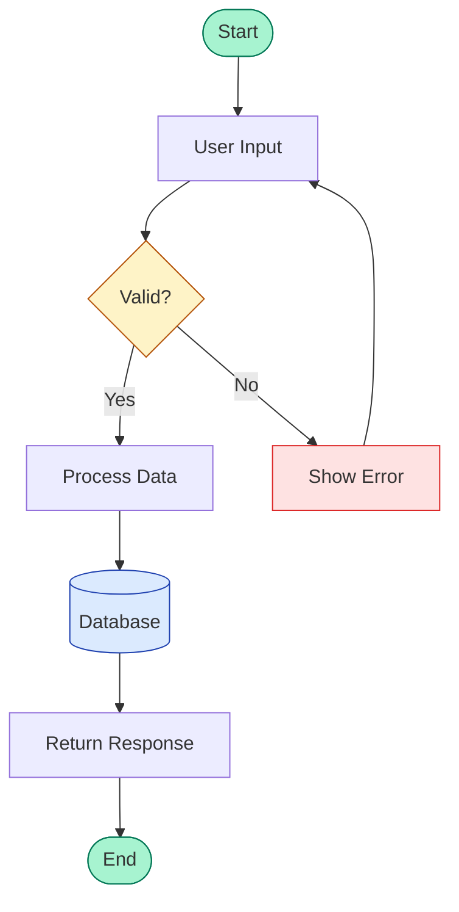
```mermaid
flowchart TD
    START(["Start"]) --> INPUT["User Input"]
    INPUT --> VALIDATE{"Valid?"}
    VALIDATE -->|Yes| PROCESS["Process Data"]
    VALIDATE -->|No| ERROR["Show Error"]
    ERROR --> INPUT
    PROCESS --> DB[("Database")]
    DB --> RESPONSE["Return Response"]
    RESPONSE --> END(["End"])

    style START fill:#a7f3d0,stroke:#047857
    style END fill:#a7f3d0,stroke:#047857
    style ERROR fill:#fee2e2,stroke:#dc2626
    style VALIDATE fill:#fef3c7,stroke:#b45309
    style DB fill:#dbeafe,stroke:#1e40af
```

### 2. Sequence Diagram

**Participant types:** `participant` (box), `actor` (stick figure)
**Arrow types:** `->>` (solid), `-->>` (dashed), `-x` (cross), `-)` (async)
**Activation:** `activate`/`deactivate` or `+`/`-` shorthand
**Features:** `Note`, `loop`, `alt`/`else`, `opt`, `par`, `critical`, `break`, `rect` (highlight)

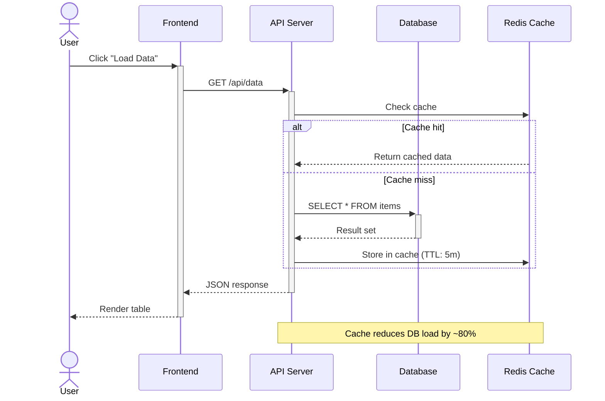
```mermaid
sequenceDiagram
    actor U as User
    participant FE as Frontend
    participant API as API Server
    participant DB as Database
    participant CACHE as Redis Cache

    U->>+FE: Click "Load Data"
    FE->>+API: GET /api/data
    API->>CACHE: Check cache
    alt Cache hit
        CACHE-->>API: Return cached data
    else Cache miss
        API->>+DB: SELECT * FROM items
        DB-->>-API: Result set
        API->>CACHE: Store in cache (TTL: 5m)
    end
    API-->>-FE: JSON response
    FE-->>-U: Render table

    Note over API,CACHE: Cache reduces DB load by ~80%
```

### 3. Entity-Relationship (ER) Diagram

**Relationship types:**
```
||--||   exactly one to exactly one
||--o{   exactly one to zero or more
}|--|{   one or more to one or more
}o--o{   zero or more to zero or more
```

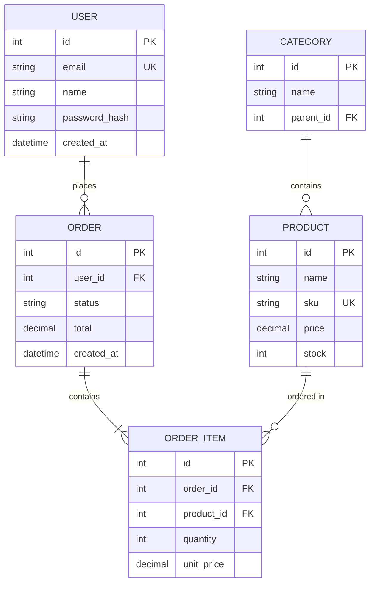
```mermaid
erDiagram
    USER ||--o{ ORDER : places
    USER {
        int id PK
        string email UK
        string name
        string password_hash
        datetime created_at
    }
    ORDER ||--|{ ORDER_ITEM : contains
    ORDER {
        int id PK
        int user_id FK
        string status
        decimal total
        datetime created_at
    }
    PRODUCT ||--o{ ORDER_ITEM : "ordered in"
    PRODUCT {
        int id PK
        string name
        string sku UK
        decimal price
        int stock
    }
    ORDER_ITEM {
        int id PK
        int order_id FK
        int product_id FK
        int quantity
        decimal unit_price
    }
    CATEGORY ||--o{ PRODUCT : contains
    CATEGORY {
        int id PK
        string name
        int parent_id FK
    }
```

### 4. Class Diagram

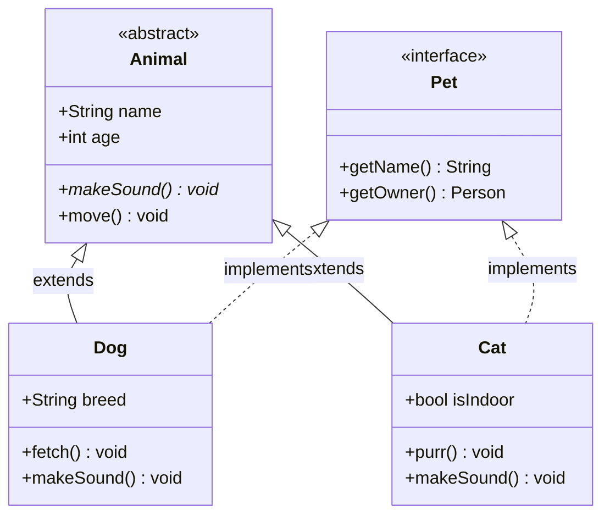
```mermaid
classDiagram
    class Animal {
        <<abstract>>
        +String name
        +int age
        +makeSound()* void
        +move() void
    }
    class Dog {
        +String breed
        +fetch() void
        +makeSound() void
    }
    class Cat {
        +bool isIndoor
        +purr() void
        +makeSound() void
    }
    class Pet {
        <<interface>>
        +getName() String
        +getOwner() Person
    }

    Animal <|-- Dog : extends
    Animal <|-- Cat : extends
    Pet <|.. Dog : implements
    Pet <|.. Cat : implements
```

**Relationship types:** `<|--` inheritance, `<|..` implementation, `*--` composition, `o--` aggregation, `-->` association, `..>` dependency

### 5. State Diagram

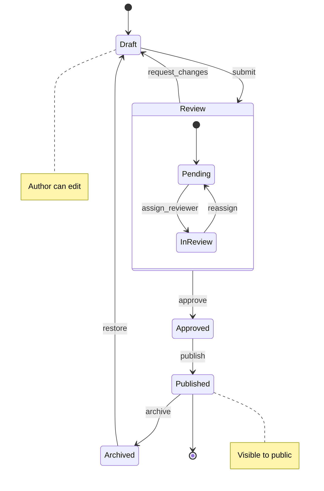
```mermaid
stateDiagram-v2
    [*] --> Draft
    Draft --> Review : submit
    Review --> Approved : approve
    Review --> Draft : request_changes
    Approved --> Published : publish
    Published --> Archived : archive
    Archived --> Draft : restore
    Published --> [*]

    state Review {
        [*] --> Pending
        Pending --> InReview : assign_reviewer
        InReview --> Pending : reassign
    }

    note right of Draft : Author can edit
    note right of Published : Visible to public
```

### 6. Pie Chart

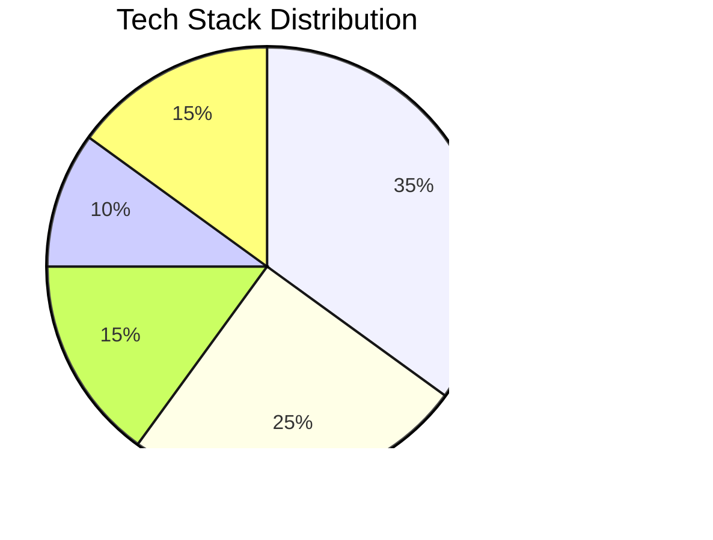
```mermaid
pie title Tech Stack Distribution
    "TypeScript" : 35
    "Python" : 25
    "Go" : 15
    "Rust" : 10
    "Other" : 15
```

### 7. Gantt Chart

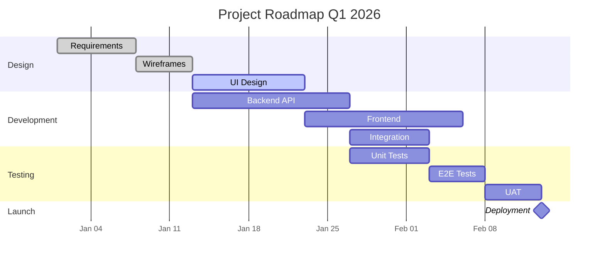
```mermaid
gantt
    title Project Roadmap Q1 2026
    dateFormat YYYY-MM-DD
    axisFormat %b %d

    section Design
    Requirements     :done, des1, 2026-01-01, 7d
    Wireframes       :done, des2, after des1, 5d
    UI Design        :active, des3, after des2, 10d

    section Development
    Backend API      :dev1, after des2, 14d
    Frontend         :dev2, after des3, 14d
    Integration      :dev3, after dev1, 7d

    section Testing
    Unit Tests       :test1, after dev1, 7d
    E2E Tests        :test2, after dev3, 5d
    UAT              :test3, after test2, 5d

    section Launch
    Deployment       :milestone, launch, after test3, 0d
```

### 8. Mindmap

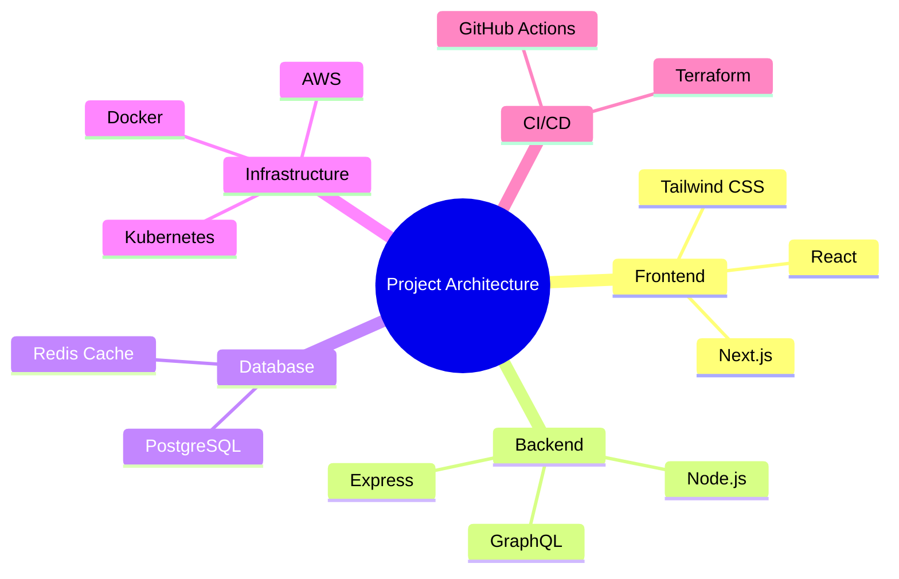
```mermaid
mindmap
    root((Project Architecture))
        Frontend
            React
            Next.js
            Tailwind CSS
        Backend
            Node.js
            Express
            GraphQL
        Database
            PostgreSQL
            Redis Cache
        Infrastructure
            AWS
            Docker
            Kubernetes
        CI/CD
            GitHub Actions
            Terraform
```

### 9. Timeline

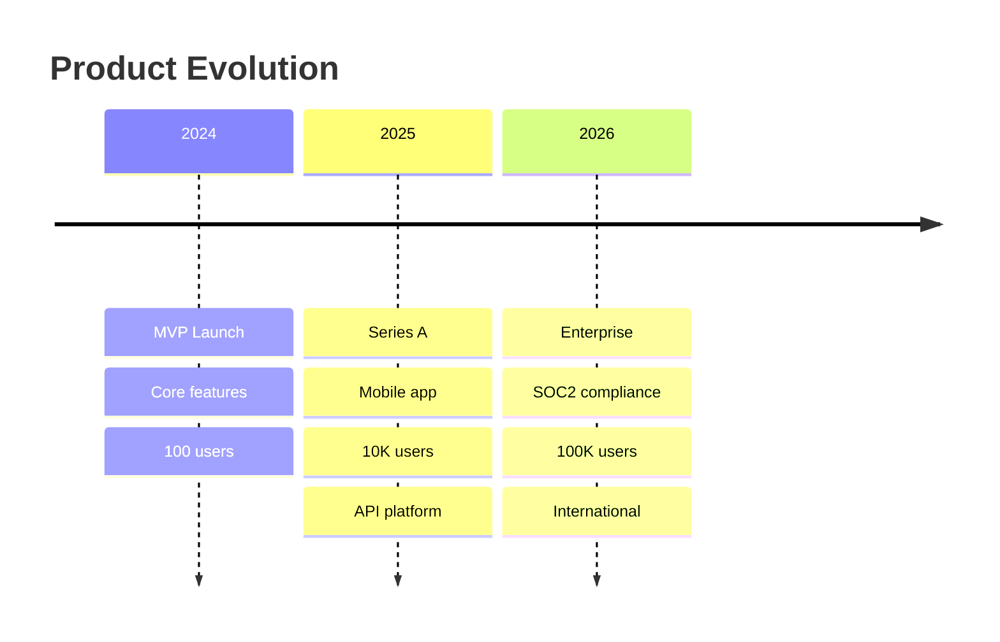
```mermaid
timeline
    title Product Evolution
    2024 : MVP Launch
         : Core features
         : 100 users
    2025 : Series A
         : Mobile app
         : 10K users
         : API platform
    2026 : Enterprise
         : SOC2 compliance
         : 100K users
         : International
```

### 10. Git Graph

```mermaid
gitgraph
    commit id: "init"
    commit id: "setup"
    branch develop
    checkout develop
    commit id: "feature-a"
    commit id: "feature-b"
    branch feature/auth
    checkout feature/auth
    commit id: "auth-impl"
    commit id: "auth-tests"
    checkout develop
    merge feature/auth id: "merge-auth"
    checkout main
    merge develop id: "release-1.0" tag: "v1.0.0"
    commit id: "hotfix" type: HIGHLIGHT
```

### 11. C4 System Context Diagram

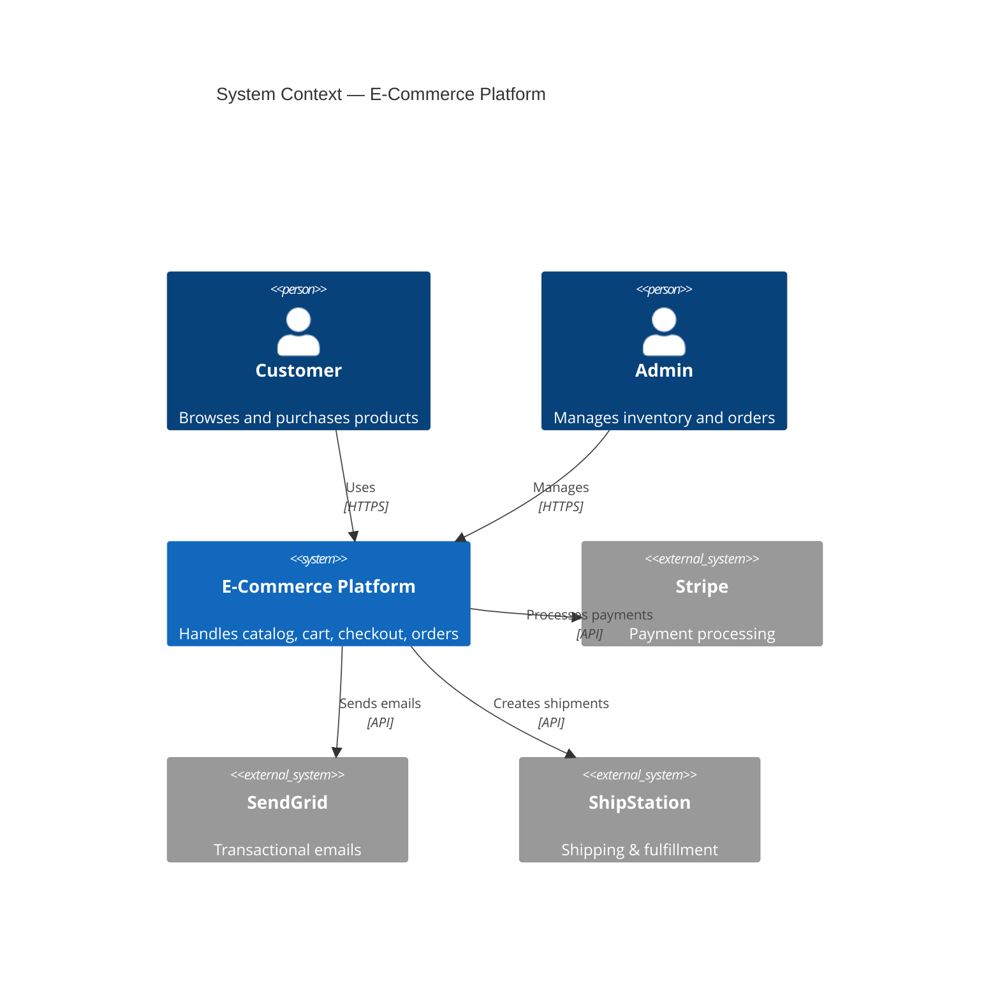
```mermaid
C4Context
    title System Context — E-Commerce Platform

    Person(customer, "Customer", "Browses and purchases products")
    Person(admin, "Admin", "Manages inventory and orders")

    System(ecom, "E-Commerce Platform", "Handles catalog, cart, checkout, orders")

    System_Ext(payment, "Stripe", "Payment processing")
    System_Ext(email, "SendGrid", "Transactional emails")
    System_Ext(shipping, "ShipStation", "Shipping & fulfillment")

    Rel(customer, ecom, "Uses", "HTTPS")
    Rel(admin, ecom, "Manages", "HTTPS")
    Rel(ecom, payment, "Processes payments", "API")
    Rel(ecom, email, "Sends emails", "API")
    Rel(ecom, shipping, "Creates shipments", "API")
```

### 12. Kanban Board

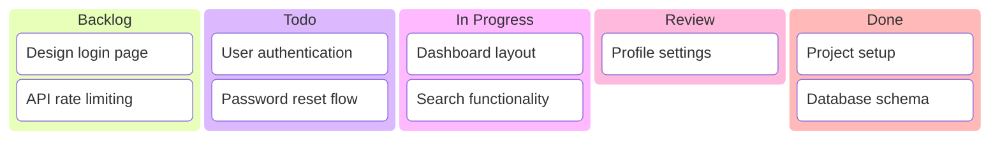
```mermaid
kanban
    backlog[Backlog]
        task1[Design login page]
        task2[API rate limiting]
    todo[Todo]
        task3[User authentication]
        task4[Password reset flow]
    inprogress[In Progress]
        task5[Dashboard layout]
        task6[Search functionality]
    review[Review]
        task7[Profile settings]
    done[Done]
        task8[Project setup]
        task9[Database schema]
```

### 13. Block Diagram

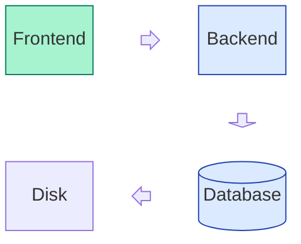
```mermaid
block
    columns 3
    Frontend blockArrowId1<[" "]>(right) Backend
    space:2 down<[" "]>(down)
    Disk left<[" "]>(left) Database[("Database")]

    classDef front fill:#a7f3d0,stroke:#047857
    classDef back fill:#dbeafe,stroke:#1e40af
    class Frontend front
    class Backend,Database back
```

### 14. Quadrant Chart

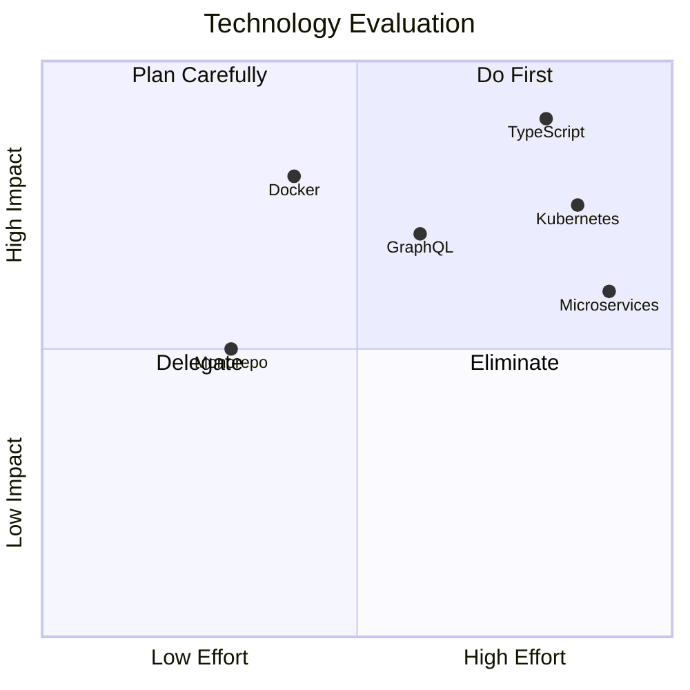
```mermaid
quadrantChart
    title Technology Evaluation
    x-axis Low Effort --> High Effort
    y-axis Low Impact --> High Impact
    quadrant-1 Do First
    quadrant-2 Plan Carefully
    quadrant-3 Delegate
    quadrant-4 Eliminate
    TypeScript: [0.8, 0.9]
    GraphQL: [0.6, 0.7]
    Microservices: [0.9, 0.6]
    Monorepo: [0.3, 0.5]
    Docker: [0.4, 0.8]
    Kubernetes: [0.85, 0.75]
```

### 15. XY Chart

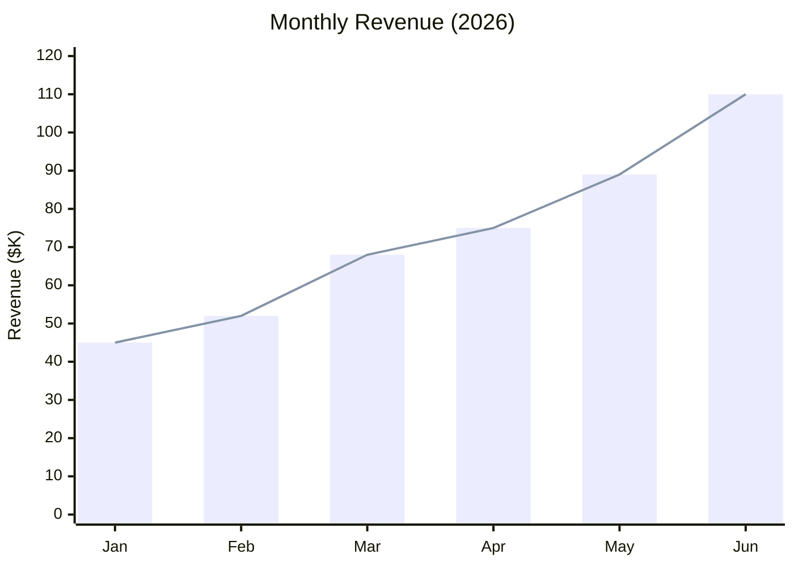
```mermaid
xychart
    title "Monthly Revenue (2026)"
    x-axis [Jan, Feb, Mar, Apr, May, Jun]
    y-axis "Revenue ($K)" 0 --> 120
    bar [45, 52, 68, 75, 89, 110]
    line [45, 52, 68, 75, 89, 110]
```

### 16. User Journey

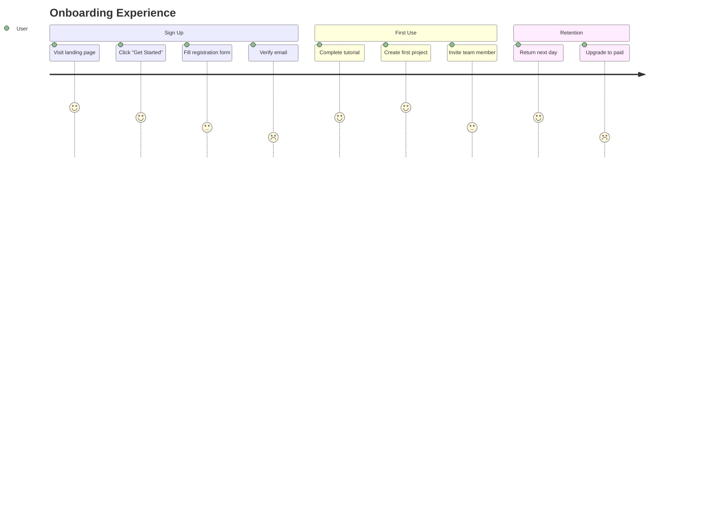
```mermaid
journey
    title Onboarding Experience
    section Sign Up
        Visit landing page: 5: User
        Click "Get Started": 4: User
        Fill registration form: 3: User
        Verify email: 2: User
    section First Use
        Complete tutorial: 4: User
        Create first project: 5: User
        Invite team member: 3: User
    section Retention
        Return next day: 4: User
        Upgrade to paid: 2: User
```

### 17. Requirement Diagram

```mermaid
requirementDiagram
    requirement high_availability {
        id: REQ-001
        text: System must have 99.9% uptime
        risk: high
        verifymethod: test
    }
    requirement data_encryption {
        id: REQ-002
        text: All data must be encrypted at rest and in transit
        risk: medium
        verifymethod: inspection
    }
    element load_balancer {
        type: service
        docref: arch/lb.md
    }
    element tls_cert {
        type: config
        docref: infra/tls.md
    }
    load_balancer - satisfies -> high_availability
    tls_cert - satisfies -> data_encryption
```

### 18. Sankey Diagram

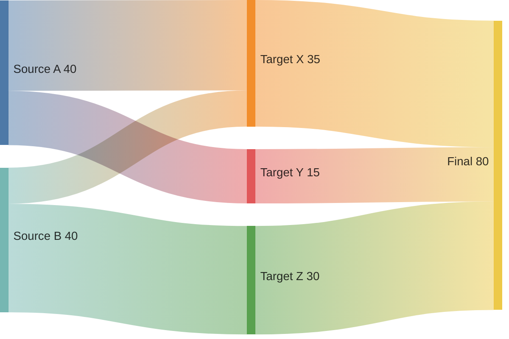
```mermaid
sankey
    Source A,Target X,25
    Source A,Target Y,15
    Source B,Target X,10
    Source B,Target Z,30
    Target X,Final,35
    Target Y,Final,15
    Target Z,Final,30
```

### 19. Architecture Diagram (beta)

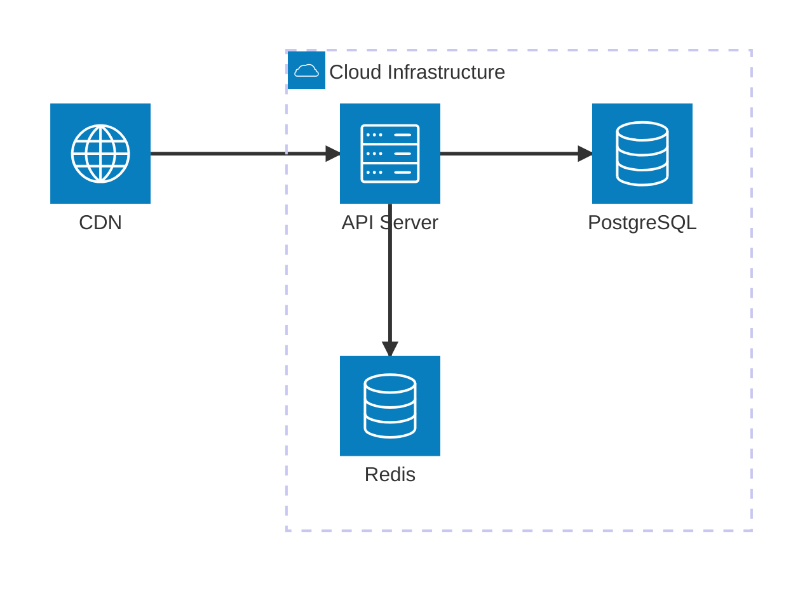
```mermaid
architecture-beta
    group cloud(cloud)[Cloud Infrastructure]

    service api(server)[API Server] in cloud
    service db(database)[PostgreSQL] in cloud
    service cache(database)[Redis] in cloud
    service cdn(internet)[CDN]

    cdn:R --> L:api
    api:R --> L:db
    api:B --> T:cache
```

---

## Style Guide

### Semantic Color Palette

| Purpose | Fill | Stroke | When to Use |
|---------|------|--------|-------------|
| Primary / Main | `#dbeafe` | `#1e40af` | Core components, main systems |
| Secondary | `#e0e7ff` | `#4338ca` | Supporting components |
| Action / Trigger | `#fed7aa` | `#c2410c` | User actions, entry points, APIs |
| Success / Output | `#a7f3d0` | `#047857` | Results, endpoints, success states |
| Decision / Logic | `#fef3c7` | `#b45309` | Conditionals, routers, switches |
| AI / Processing | `#ddd6fe` | `#6d28d9` | AI, ML, async processing |
| Error / Warning | `#fee2e2` | `#dc2626` | Errors, alerts, failures |
| Database / Storage | `#e0f2fe` | `#0369a1` | DBs, caches, file storage |
| External / Third-party | `#f3f4f6` | `#6b7280` | External services, 3rd party APIs |
| Highlight | `#fef9c3` | `#a16207` | Important callouts |

### Styling Syntax

**Individual nodes:**
```
style NODE_ID fill:#color,stroke:#color,stroke-width:2px
```

**Class-based (reusable):**
```
classDef primary fill:#dbeafe,stroke:#1e40af,stroke-width:2px
classDef error fill:#fee2e2,stroke:#dc2626,stroke-width:2px
class NodeA,NodeB primary
class ErrorNode error
```

**Subgraph styling:**
```
style SubgraphName fill:#dbeafe,stroke:#1e40af,stroke-width:2px
```

### Design Rules

**Flowcharts & Block Diagrams:**
1. **Always style nodes** — never leave default gray. Use semantic colors.
2. **Always label arrows** — describe the relationship/action.
3. **Use subgraphs** for logical grouping.
4. **Direction:** `LR` for processes, `TD` for hierarchies.
5. **Quote labels** with brackets: `A["My Label"]`.
6. **Max 15-20 nodes** per diagram — split if larger.
7. **Start/end:** stadium shapes `(["Start"])`. **DBs:** cylinder `[("DB")]`. **Decisions:** diamond `{"Q?"}`.

**Sequence Diagrams:**
8. **Use `actor`** for humans, `participant` for systems.
9. **Activation bars** (`+`/`-`) for request-response pairs.
10. **Use `alt`/`opt`/`par`/`loop`** for conditional/parallel/repeated logic.

**All Diagrams:**
11. **Use `<br/>` for multiline** — max 3 lines per node.
12. **Add `accTitle` and `accDescr`** for accessibility (screen readers).
13. **Don't rely on color alone** — combine with shapes, line styles, and labels.

### Accessibility

Add to any diagram for screen reader support:
```
accTitle: Descriptive title of the diagram
accDescr: Brief description of what the diagram shows
```

Example:
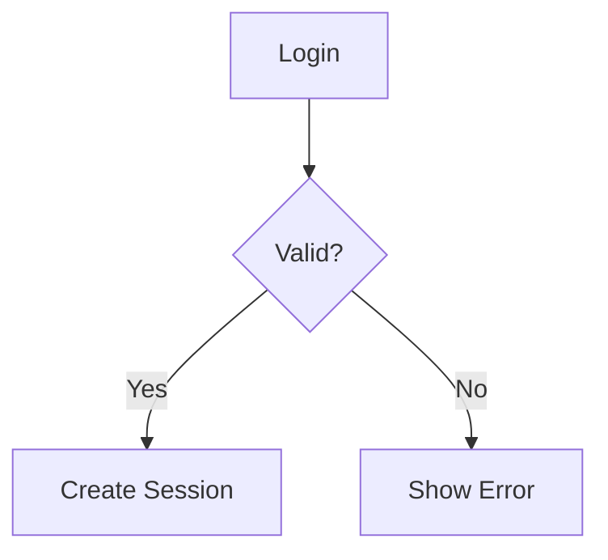
```mermaid
flowchart TD
    accTitle: User Authentication Flow
    accDescr: Shows login, validation, and session creation steps
    A["Login"] --> B{"Valid?"}
    B -->|Yes| C["Create Session"]
    B -->|No| D["Show Error"]
```

---

## Render Commands

```bash
# PNG (recommended for local viewing)
npx --yes @mermaid-js/mermaid-cli -i input.mmd -o output.png -b white --scale 2

# SVG (scalable, good for docs)
npx --yes @mermaid-js/mermaid-cli -i input.mmd -o output.svg -b white

# PDF
npx --yes @mermaid-js/mermaid-cli -i input.mmd -o output.pdf -b white

# Custom width
npx --yes @mermaid-js/mermaid-cli -i input.mmd -o output.png -b white --scale 2 --width 1600

# With config (dark theme, etc)
npx --yes @mermaid-js/mermaid-cli -i input.mmd -o output.png -b white -c config.json
```

## Common Scenarios

| Scenario | Recommended Approach |
|----------|---------------------|
| "Show me the architecture" | Flowchart with subgraphs OR C4 Context |
| "Database design" | ER diagram with PKs/FKs |
| "How does the API work?" | Sequence diagram with participants |
| "What's the deploy process?" | Flowchart LR with stages |
| "Project timeline" | Gantt chart with sections |
| "Compare technologies" | Quadrant chart |
| "Show data breakdown" | Pie chart |
| "Git branching strategy" | Git graph |
| "Feature lifecycle" | State diagram |
| "System components" | Block diagram or C4 Container |
| "Brainstorm topics" | Mindmap |
| "Sprint board" | Kanban |
| "Revenue/metrics over time" | XY chart |
| "Data pipeline flow" | Flowchart with styled nodes |
| "Microservice communication" | Sequence + Flowchart combo |
| "User experience / satisfaction" | User Journey diagram |
| "Compliance / traceability" | Requirement diagram |
| "Cloud infrastructure / topology" | Architecture diagram (beta) |
| "Org chart / team hierarchy" | Flowchart TD with subgraphs |
| "Data flow volumes" | Sankey diagram |
| "Skill/feature comparison" | Radar chart (beta) |
