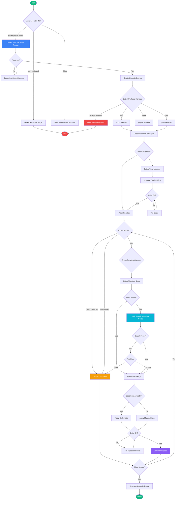
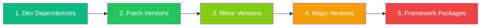
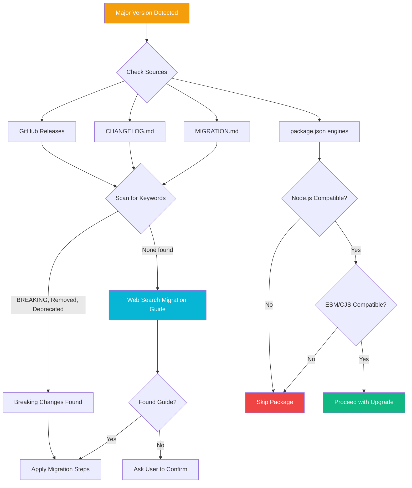
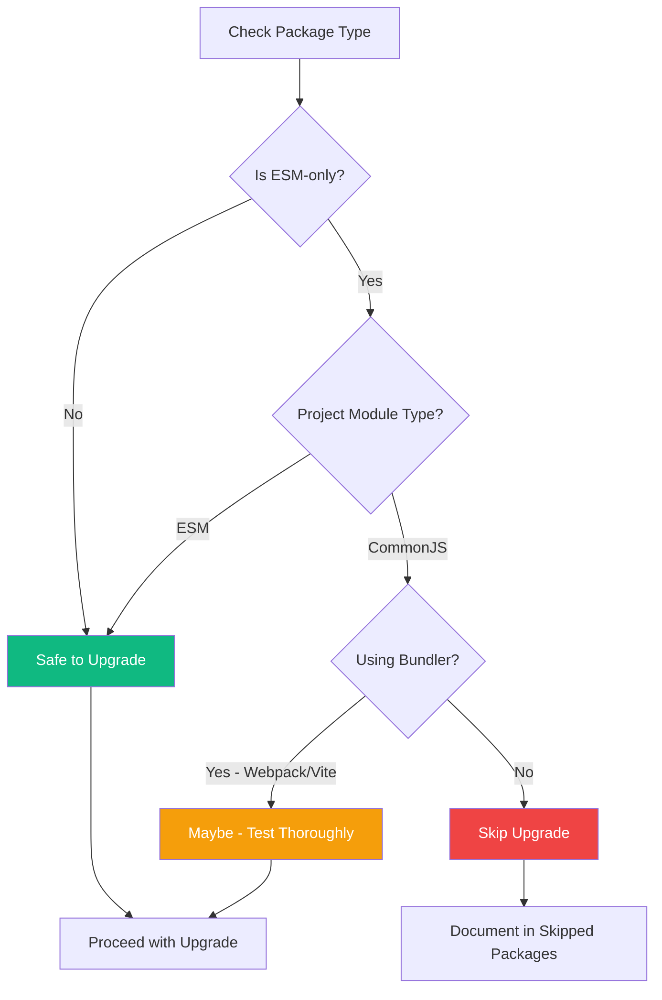
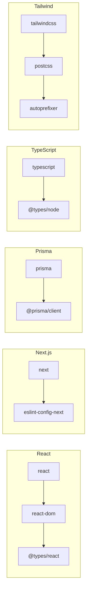

# Package Upgrade Skill

Safely upgrade JavaScript/TypeScript packages with breaking change detection, migration guidance, and automated code migrations.

## Features

- **Cross-platform** - Works on Windows, macOS, and Linux
- **Package manager agnostic** - Supports npm, pnpm, and yarn
- **Git safety** - Creates branches, never modifies main directly
- **Breaking change detection** - Checks migration docs before major upgrades
- **Automatic web search** - Searches for migration guides when docs not found
- **ESM/CJS compatibility** - Warns about module system conflicts
- **Blocker detection** - Automatically detects ESM/CJS conflicts, Node.js requirements, deprecations

## Quick Start

Simply ask Claude to upgrade packages:

```
upgrade packages
```

Or be more specific:

```
upgrade react to latest
upgrade all dev dependencies
check for outdated packages
```

## Workflow Flowchart



## Upgrade Order

The skill follows a specific order to minimize risk:



## Breaking Change Detection

For major version upgrades, the skill checks:



## Detecting Major Version Blockers

The skill automatically detects blockers before upgrading:

### Detection Commands

```bash
# Check if package is ESM-only
npm view {package}@{version} type
# Returns "module" = ESM-only, empty = CommonJS compatible

# Check your project type
node -e "console.log(require('./package.json').type || 'commonjs')"

# Check Node.js requirements
npm view {package}@{version} engines

# Check if deprecated
npm view {package} deprecated
```

### Decision Flow for ESM Packages



## Dependency Groups

These packages must be upgraded together:



## Upgrade Report Template

After upgrades, the skill generates a report:

```markdown
# Package Upgrade Report
**Date:** {date} | **PM:** {npm|pnpm|yarn} | **Branch:** {branch-name}

## Summary
- Upgraded: {count} | Major: {count} | Minor: {count} | Patch: {count} | Skipped: {count}

## Upgrades
| Package | From | To | Breaking | Migration |
|---------|------|-----|----------|-----------|
| {package} | {old} | {new} | Yes/No | {details} |

## Skipped
| Package | Reason |
|---------|--------|
| {package} | {reason} |

## Verification
- [ ] Type check
- [ ] Lint
- [ ] Tests
- [ ] Build
```

## Rollback

If something goes wrong:

```bash
# Rollback to before upgrade
git checkout main -- package.json {lockfile}
{pm} install
```

Or simply:

```bash
# Delete the upgrade branch and return to main
git checkout main
git branch -D chore/upgrade-packages-{date}
```

## Configuration

The skill automatically detects:

| Setting | Detection Method |
|---------|------------------|
| Package manager | Lockfile presence (`package-lock.json`, `pnpm-lock.yaml`, `yarn.lock`) |
| Project type | `package.json` field `"type": "module"` or CommonJS (default) |
| Node.js version | `package.json` engines field |
| Monorepo | `package.json` workspaces field |

## Supported Languages

This skill is specifically for JavaScript/TypeScript projects. For other languages, use:

| Language | Command |
|----------|---------|
| Go | `go get -u ./...` |
| Rust | `cargo update` |
| Python | `pip-review --auto` or `poetry update` |
| PHP | `composer update` |
| Ruby | `bundle update` |
| Java (Maven) | `mvn versions:use-latest-releases` |
| Java (Gradle) | `gradle dependencyUpdates` |
| .NET | `dotnet outdated` |

## Related Files

- [`SKILL.md`](./SKILL.md) - Full skill instructions and commands
