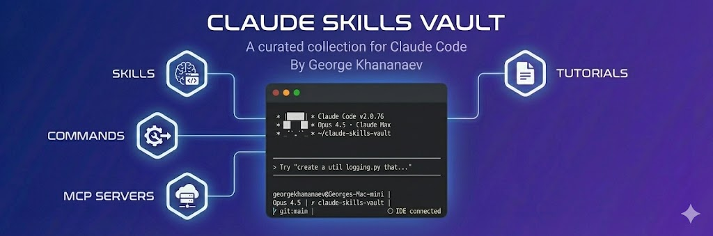

# Claude Skills Vault



A curated collection of skills, commands, and MCP servers for Claude Code.

## Quick Install

```bash
# Install the CLI globally or use npx
npx claude-skills-vault list                # Browse all available skills
npx claude-skills-vault install brainstorm  # Install a specific skill
npx claude-skills-vault search react        # Search by keyword
npx claude-skills-vault info owasp-security # View skill details
```

```bash
# Install multiple skills at once
npx claude-skills-vault install brainstorm owasp-security github-cli

# Install all skills and commands
npx claude-skills-vault install --all

# Install only skills or only commands
npx claude-skills-vault install --skills
npx claude-skills-vault install --commands

# Preview without installing
npx claude-skills-vault install brainstorm --dry-run

# Overwrite existing skills
npx claude-skills-vault install brainstorm --force
```

Skills are downloaded directly from this repository into your project's `.claude/skills/` directory. No git clone required.

## What's Inside

| Category | Count | Details |
|----------|-------|---------|
| **Skills** | 52 | Development, security, testing, frontend, backend, mobile, AI, SEO | See [SKILLS.md](SKILLS.md) |
| **Commands** | 7 | Git workflow, PR management, feature planning, npm release | See [COMMANDS.md](COMMANDS.md) |
| **MCP Servers** | 38 | Database, cloud, design, analytics, CI/CD configs | See [MCP-SERVERS.md](MCP-SERVERS.md) |

## Manual Installation

```bash
git clone https://github.com/georgekhananaev/claude-skills-vault.git
cp -r claude-skills-vault/.claude your-project/
```

## Tutorials

- [Commands Tutorial](tutorials/COMMANDS_TUTORIAL.md) - Creating slash commands
- [Skills Tutorial](tutorials/SKILLS_TUTORIAL.md) - Creating and using skills
- [MCP Servers Tutorial](tutorials/MCP_SERVERS_TUTORIAL.md) - Building MCP servers

## Contributing

Contributions are welcome! Feel free to submit pull requests with new skills, commands, or MCP servers.

## Credits

Created by **George Khananaev**

Skills sourced from [ComposioHQ](https://github.com/ComposioHQ): document-skills (xlsx, docx, pptx, pdf), project-change-log, skill-creator, mcp-builder

Skills contributed by [garesuta](https://github.com/garesuta) ([PR #4](https://github.com/georgekhananaev/claude-skills-vault/pull/4), [PR #5](https://github.com/georgekhananaev/claude-skills-vault/pull/5)): react-best-practices, next-cache-components, next-upgrade, senior-backend, multi-agent-patterns, parallel-agents, vercel-react-native-skills

Skills contributed by [palakorn-moonholidays](https://github.com/palakorn-moonholidays) ([PR #6](https://github.com/georgekhananaev/claude-skills-vault/pull/6)): owasp-security, color-accessibility-audit

## Changelog

See [CHANGELOG.md](CHANGELOG.md) for version history and release notes.

## License

[MIT License](LICENSE) - See [NOTICE](NOTICE) for attribution guidelines.
